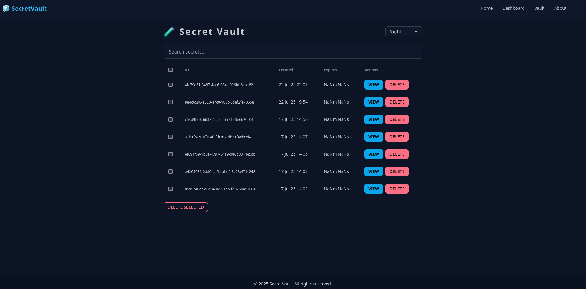
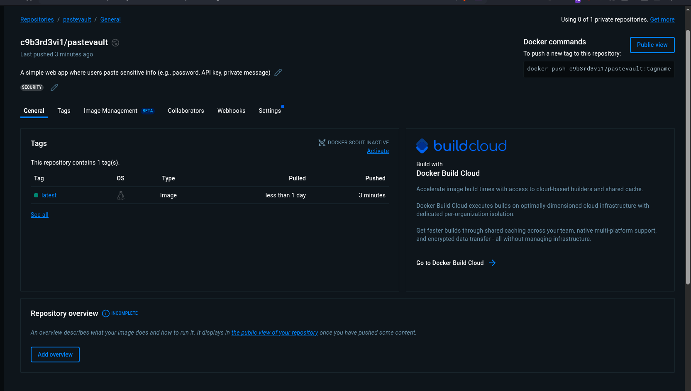
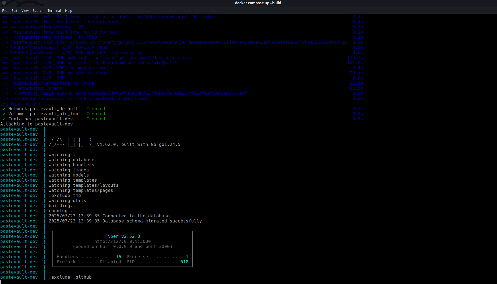

# pastevault

A simple web app where users paste sensitive info (e.g., password, API key, private message), and it gives a single-use or time-limited link.
Once opened (or after a set time), the message self-destructs.
Great for sharing secrets securely without email/chat history risks.

**PasteVault** [Fiber](https://gofiber.io/) for securely sharing secrets. Secrets are displayed **only once** and protected with **IP-based rate limiting**.

## Features

- **Single-use links**: Each paste generates a unique link that can only be accessed once.
- **Time-limited links**: Set an expiration time for your pastes.
- **Secure storage**: Your data is encrypted and stored securely.
- **Easy sharing**: Share your pastes via email, social media, or any other platform.

## Installation

### Prerequisites

- Go 1.23+
- Git

To run pastevault locally, follow these steps:

1. Clone the repository:

   ```bash
   git clone https://github.com/C9b3rD3vi1/pastevault.git
   ```

2. Install dependencies:

   ```bash
   cd pastevault

   go mod tidy
   ```

3. Start the development server:

   ```bash
   go run main.go
   ```

4. Access the app at http://localhost:3000

## Usage

To use pastevault, follow these steps:

1. Paste your sensitive information into the text area.
2. Set the expiration time for your paste (optional).
3. Click the "Create Link" button.
4. Share the generated link with the recipient.

## Contributing

Contributions are welcome! Please follow these guidelines:

1. Fork the repository.
2. Create a new branch for your feature or bug fix.
3. Make your changes and commit them.
4. Push your changes to your fork.
5. Submit a pull request.

## License

pastevault is licensed under the MIT License. See the [LICENSE](LICENSE) file for details.

## Project in action




**_ Container image_**
**_ Dockerfile_**


## Code

```go
func GetUserSecret(c *fiber.Ctx) error {
	id := c.Params("id")

	var secret models.Secret
	// Look up secret by ID
	result := database.DB.First(&secret, "id = ?", id)

	// If not found or already viewed or expired
	if result.Error != nil || secret.Viewed || time.Now().After(secret.ExpiresAt) {
		return c.SendString("This secret is unavailable or has expired.")
	}

	// Mark as viewed
	secret.Viewed = true
	database.DB.Save(&secret)

	// Render the secret page
	return c.Render("pages/secret", fiber.Map{
		"Content": secret.Content,
	})
}
```

# 🐳 Docker

You can build and run this app using Docker.

🔧 Build the Docker Image

```
 docker build -t c9b3rd3vi1/pastevault .

```

🚀 Run the Docker Container

```
docker run -p 3000:3000 c9b3rd3vi1/pastevault
```



The app will be accessible at: http://localhost:3000

☁️ Push to Docker Hub

## Tag the image

    docker tag pastevault c9b3rd3vi1/pastevault:latest

## Push to Docker Hub

    docker push c9b3rd3vi1/pastevault:latest

⚙️ GitHub Actions CI/CD (Optional)

This project supports automated Docker builds using GitHub Actions.

To enable this:

Create two GitHub Secrets:

    DOCKERHUB_USERNAME – Your Docker Hub username

    DOCKERHUB_TOKEN – Create a Personal Access Token

Add a GitHub Actions workflow (see .github/workflows/docker.yml in this repo for an example)

# CI/CD Pipeline

```
# Workflow file for Docker Push and Publish automation

name: Docker Push and Publish

on:
  push:
    branches:
      - main


jobs:
  build-and-push:
    runs-on: ubuntu-latest
    steps:
      - name: Checkout code
        uses: actions/checkout@v2

      - name: Set up Docker Buildx
        uses: docker/setup-buildx-action@v1

      - name: Login to Docker Hub
        uses: docker/login-action@v1
        with:
          username: ${{ secrets.DOCKER_USERNAME }}
          password: ${{ secrets.DOCKER_PASSWORD }}

      - name: Build and push Docker image
        uses: docker/build-push-action@v2
        with:
          context: .
          push: true
          tags: ${{ secrets.DOCKER_USERNAME }}/my-image:latest

```
